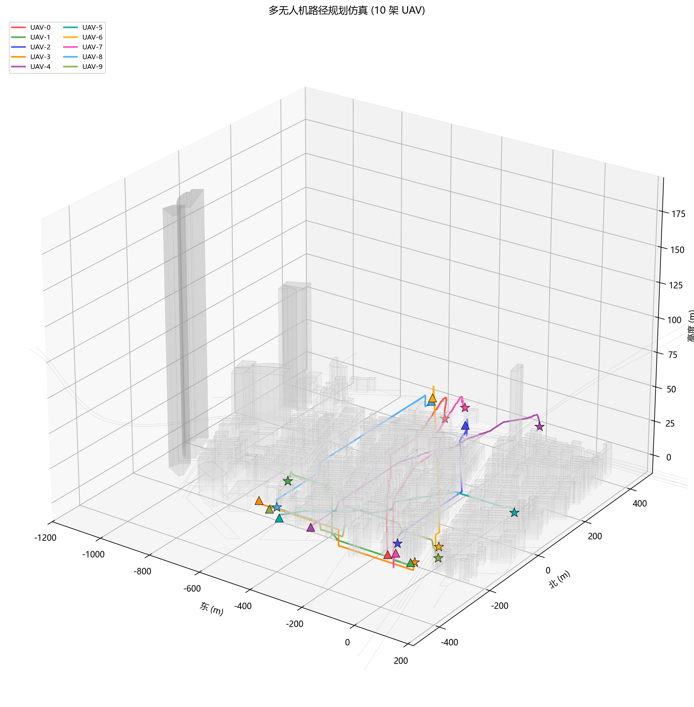
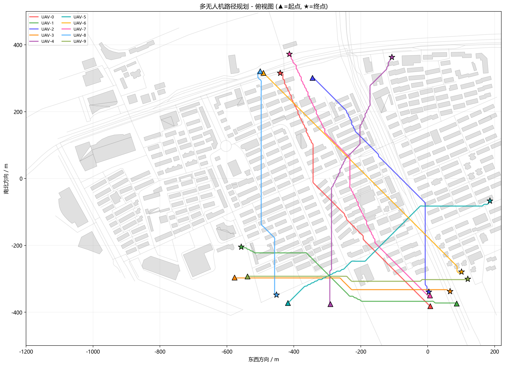

# 基于真实地图数据的多无人机三维路径规划仿真

本项目实现了一套完整的多无人机 (UAV) 三维路径规划仿真系统。系统基于 OpenStreetMap (OSM) 真实城市地图数据构建仿真环境（以上海某区域为例），采用三维 A* 算法进行全局路径规划，结合质点动力学模型与 PD 控制器进行路径追踪，并通过优先级调度策略实现多机协同避碰 。

## 实现内容

* **真实地图环境**：基于 OpenStreetMap (OSM) 数据解析构建，包含约 417 栋建筑和 224 条道路。
* **三维路径规划**：采用 26-邻域的三维 A* 算法，包含启发式搜索与路径后处理（简化与平滑）。
* **动力学模型**：建立 UAV 三维质点动力学模型，使用 PD 控制器追踪规划路径，包含速度与加速度限幅。
* **多机协同**：支持 10 架 UAV 同时飞行，采用基于优先级的调度策略 (Priority-based Planning) 处理多机避碰。
* **碰撞检测**：内置完整的 UAV-建筑物碰撞检测及 UAV 间互碰检测机制。
* **可视化**：提供 3D 和 2D 的飞行轨迹可视化输出。

## 项目结构

系统由两个核心模块组成：
* `parse_osm.py`: OSM 地图数据解析与环境构建模块。
* `uav_simulation.py`: UAV 建模、路径规划、仿真与可视化模块。

## 环境依赖

[cite_start]本项目运行需要 Python 3.8+ 环境。

| 依赖库 | 用途 | 版本要求 |
| :--- | :--- | :--- |
| **NumPy** | 数值计算、数组运算 | $\ge 1.20$ |
| **Matplotlib** | 2D/3D 可视化 | $\ge 3.5$ |

**安装依赖**:
`pip install numpy matplotlib`

## 运行指南
**仅运行地图解析**:
`python parse_osm.py`

**运行完整多机仿真**:
`python uav_simulation.py`

## 核心技术细节
* **建筑高度估算**: 优先级为 明确高度标签 > 楼层数标签(默认层高3.0m) > 建筑类型推断 > 默认值10.0m。
* **栅格地图**: 空间范围 $x \in [-600,600]$, $y \in [-500,500]$, $z \in [0,80]$, 分辨率 $\delta=5 m$。
* **UAV 运动学约束**: 最大速度 $15 m/s$, 最大加速度 $5 m/s^2$, 安全半径 $5 m$ 。
* **PD 控制器**: 比例增益 $k_p=2.0$, 微分增益 $k_d=1.5$。
* **A* 算法**: 采用26邻域连接，启发函数采用三维欧氏距离。
* **路径后处理**: 去除方向向量夹角余弦值 $>0.999$ 的共线冗余点，并进行弧长参数化线性插值(每2m生成一个插值点)。
* **多机避碰**: 采用优先级调度，低优先级UAV将高优先级UAV的路径点及其安全半径($8 m$)内的栅格标记为临时占据。

## 可视化输出
系统生成两张结果图像:
* `uav_3d_paths.png`: 三维视图,包含半透明建筑、所有UAV的飞行轨迹(实线)与规划路径(虚线)、起点与终点。
* 
* `uav_2d_paths.png`: 俯视图,展示路径与建筑的平面关系。
* 